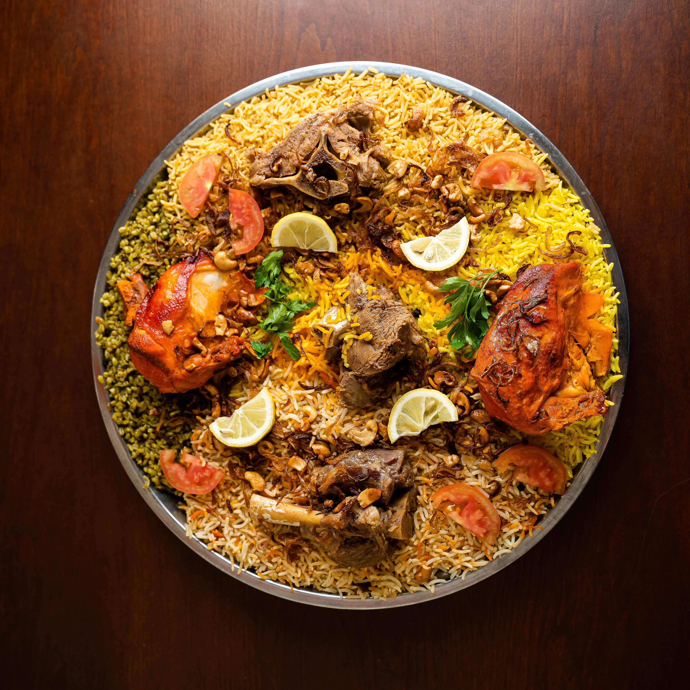

Here is a recipe for chicken and chorizo jambalaya:

# Ingredients:

* 1 pound boneless, skinless chicken breasts, cut into bite-sized pieces
* 1/2 pound chorizo sausage, sliced
* 1 onion, diced
* 1 green bell pepper, diced
* 3 cloves garlic, minced
* 1 can (14.5 ounces) diced tomatoes, drained
* 1 can (14.5 ounces) chicken broth
* 1 1/2 cups long-grain white rice
* 1 teaspoon smoked paprika
* 1/2 teaspoon cayenne pepper
* 1/2 teaspoon dried thyme
* Salt and pepper, to taste
* 2 green onions, thinly sliced
* Optional garnish: chopped fresh parsley

# **Directions:**

1. In a large, heavy-bottomed pot or Dutch oven, brown the chicken and chorizo over medium-high heat until the chicken is cooked through and the chorizo is browned. Remove the chicken and chorizo from the pot and set aside.
2. In the same pot, sauté the onion and bell pepper until the onion is translucent, about 5 minutes. Add the garlic and sauté for another 30 seconds.
3. Stir in the drained diced tomatoes, chicken broth, rice, smoked paprika, cayenne pepper, thyme, salt, and pepper. Bring the mixture to a boil, then reduce the heat to low and simmer, covered, for 20-25 minutes, or until the rice is cooked through.
4. Stir in the cooked chicken and chorizo and heat through.
5. Top the jambalaya with sliced green onions and chopped parsley, if desired.

Serve your chicken and chorizo jambalaya hot and enjoy!